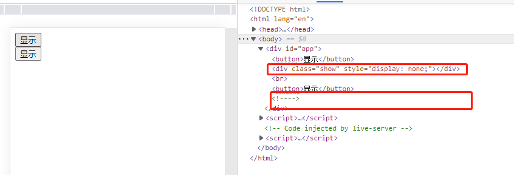
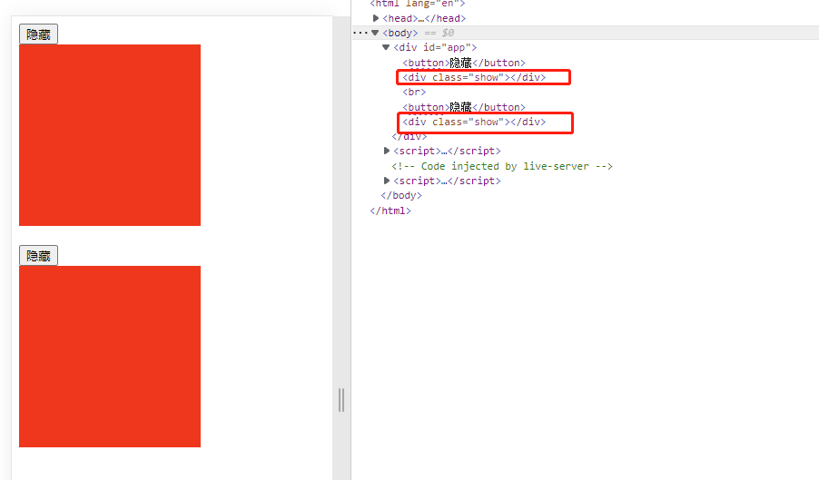

# Vue学习笔记
## 1. 安装Vue
### 1.1 通过CDN方式安装
```html
<!DOCTYPE html>
<html lang="en">
<head>
    <meta charset="UTF-8">
    <meta http-equiv="X-UA-Compatible" content="IE=edge">
    <meta name="viewport" content="width=device-width, initial-scale=1.0">
    <title>Document</title>
    <!-- 第一步：利用cdn方式引入 -->
    <script src="../vue/vue2.7.10.js"></script>
</head>
<body>
    <div id="app">
        <!-- 第五步：使用数据 -->
        <p>{{ msg }}</p>
    </div>
    
    <script>
        // 第二步：创建一个vue实例对象
        new Vue(
            {
                // 第三步：绑定一个页面标签
                el:"#app",
                // 第四步：创建数据属性
                data:{
                    msg:"hello vue"
                }
            }
        );
    </script>
</body>
</html>
```
### 1.2 通过npm方式安装

## 2. Vue语法
### 2.1 插值语法
插值语句就是通过{{ value }}表示，value可以是任意的js表达式。
```html
<!DOCTYPE html>
<html lang="en">
<head>
    <meta charset="UTF-8">
    <meta http-equiv="X-UA-Compatible" content="IE=edge">
    <meta name="viewport" content="width=device-width, initial-scale=1.0">
    <title>Document</title>
    <!-- 第一步：利用cdn方式引入 -->
    <script src="../vue/vue2.7.10.js"></script>
</head>
<body>
    <div id="app">
        <!-- 第五步：使用数据 -->
        <p>{{ msg }}</p>
        <!-- {{  }}表示一个插值语法，其中间可以输入任意的js表达式 -->
        <!-- 一个表达式 -->
        <p>{{ 1+1 }}</p>
        <!-- 一个字符串 -->
        <p>{{ "hewll" }}</p>
        <!-- 一个对象 -->
        <p>{{ {"name":"Jack"} }}</p>
        <!-- 三元运算符 -->
        <p>{{ 1>2? "真" : "假" }}</p>
        <!-- 一个对象的属性 -->
        <p>{{ person.name }}</p>
        <!-- 一个对象的操作 -->
        <p>{{ "hello".split("").reverse().join("") }}</p>
    </div>
    
    <script>
        // 第二步：创建一个vue实例对象
        new Vue(
            {
                // 第三步：绑定一个页面标签
                el:"#app",
                // 第四步：创建数据属性
                data:{
                    msg:"hello vue",
                    person:{
                        name:"tom"
                    }
                }
            }
        );
    </script>
</body>
</html>
```
### 2.2 指令系统
vue中指令系统都是以v-开头，指令的参数是vue中的属性或方法的名称。
#### 2.2.1 v-text和v-html
v-text和v-html都是将变量值显示在页面中，不同的地方在于v-html会渲染变量值，而v-text不会进行渲染。
```html
<!DOCTYPE html>
<html lang="en">
<head>
    <meta charset="UTF-8">
    <meta http-equiv="X-UA-Compatible" content="IE=edge">
    <meta name="viewport" content="width=device-width, initial-scale=1.0">
    <title>Document</title>
    <!-- 第一步：利用cdn方式引入 -->
    <script src="../vue/vue2.7.10.js"></script>
</head>
<body>
    <div id="app">
        <!-- 第五步：使用数据 -->
        <p>{{ msg }}</p>
        <!-- vue中指令系统都是以v-开头，内容为vue中变量名 -->
        <!-- v-text和插值语句效果一样，直接将内容放在页面中，不做渲染 -->
        <p v-text="msg"></p>
        <!-- v-html会对msg的内容进行渲染 -->
        <p v-html="msg"></p>
    </div>
    
    <script>
        // 第二步：创建一个vue实例对象
        new Vue(
            {
                // 第三步：绑定一个页面标签
                el:"#app",
                // 第四步：创建数据属性,data也可以是方法，返回值必须是一个对象
                data:function(){  //根据es6语法可以简写为data(){
                    return {
                        msg:"<h4>hello</h4>"
                    }
                }
            }
        );
    </script>
</body>
</html>
```
#### 2.2.2 v-if和v-show
v-if和v-show指令用来控制页面中是否显示或不显示这个标签内容。
两者的区别在于v-if用来控制dom元素，而v-show用来控制display属性。
当被控制的元素变化次数较多时，建议使用v-show来控制其显示和隐藏，而当被控制元素变化次数较少时，建议使用v-if来控制其显示和隐藏。
==官方解释==
> **v-if vs v-show**
v-if 是“真正”的条件渲染，因为它会确保在切换过程中条件块内的事件监听器和子组件适当地被销毁和重建。
> v-if 也是惰性的：如果在初始渲染时条件为假，则什么也不做——直到条件第一次变为真时，才会开始渲染条件块。
> 相比之下，v-show 就简单得多——不管初始条件是什么，元素总是会被渲染，并且只是简单地基于 CSS 进行切换。
> 一般来说，v-if 有更高的切换开销，而 v-show 有更高的初始渲染开销。因此，如果需要非常频繁地切换，则使用 v-show 较好；如果在运行时条件很少改变，则使用 v-if 较好。
```html
<!DOCTYPE html>
<html lang="en">
<head>
    <meta charset="UTF-8">
    <meta http-equiv="X-UA-Compatible" content="IE=edge">
    <meta name="viewport" content="width=device-width, initial-scale=1.0">
    <script src="../vue/vue2.7.10.js"></script>
    <style>
        .show{
            height: 200px;
            width: 200px;
            background-color: red;
        }
    </style>
    <title>Document</title>
</head>
<body>
    <div id="app">
        <!-- v-on用于绑定一个事件处理器 -->
        <button v-on:click="changeStatus">{{ buttonName }}</button>
        <!-- v-show为false时元素的display属性值为none -->
        <div class="show" v-show="isShow">
        </div>
        <br>
        <button v-on:click="changeStatus">{{ buttonName }}</button>
        <!-- v-if为false时元素的标签被移除 -->
        <div class="show" v-if="isShow">
        </div>
    </div>
    <script>
        new Vue(
            {
                el:"#app",
                data(){
                    return {
                        buttonName:"隐藏",
                        isShow:true
                    }
                },
                // 定义方法
                methods:{
                    changeStatus(){
                        // this指向vue对象
                        this.isShow = !this.isShow
                        if (this.isShow){
                            this.buttonName = "隐藏"
                        }else{
                            this.buttonName = "显示"
                        }
                    }
                }
            }
        );
    </script>
</body>
</html>
```
当同是false时，页面元素的不同。

当同是true时，页面元素相同。

#### 2.2.3 v-if,v-else-if和v-else
这三个指令如果使用的话，标签之间不能插入其他的标签，否则会报错。
在指令的=后写入判断逻辑。
```html
<!DOCTYPE html>
<html lang="en">
<head>
    <meta charset="UTF-8">
    <meta http-equiv="X-UA-Compatible" content="IE=edge">
    <meta name="viewport" content="width=device-width, initial-scale=1.0">
    <script src="../vue/vue2.7.10.js"></script>
    <title>Document</title>
</head>
<body>
    <div id="app">
        <div v-if="score > 90">优秀</div>
        <div v-else-if="score > 75">良好</div>
        <div v-else-if="score >= 60">及格</div>
        <div v-else>不及格</div>
    </div>

    <script>
        new Vue({
            el:"#app",
            data(){
                return {
                    score: 70
                }
            }
        });
    </script>
</body>
</html>
```
#### 2.2.4 v-on和v-bind
v-on指令用来绑定事件函数，参数为方法名。v-on有一个简写形式@。
v-bind指令用来为属性绑定值。v-bind有一个简写形式:。
```html
<!DOCTYPE html>
<html lang="en">
<head>
    <meta charset="UTF-8">
    <meta http-equiv="X-UA-Compatible" content="IE=edge">
    <meta name="viewport" content="width=device-width, initial-scale=1.0">
    <script src="../vue/vue2.7.10.js"></script>
    <title>Document</title>
</head>
<body>
    <div id="app">
        <!-- v-on绑定事件处理函数 -->
        <button v-on:click="showMe">点我</button>
        <!-- v-on的简写方法,v-on可以简写 -->
        <button @click="showMe">点我</button>
        <!-- v-bind为属性设定值,v-bind可以简写为: -->
        <!-- 当想动态绑定属性值时必须使用v-bind -->
        
    </div>

    <script>
        new Vue({
            el:"#app",
            data(){
                return {
                    imgSrc:"../md.photo/20221111150841.png",
                    imgAlt:"测试图片"
                }
            },
            methods:{
                showMe(){
                    alert("你在找我吗？")
                }
            }
        });
    </script>
</body>
</html>
```
当为属性绑定一个对象时，根据对象key的value，将属性值绑定为对象的key
```html
<body>
    <div id="app">
        <div @mouseenter="activate" @mouseleave="deactivate" class="basic" :class="{active:isActive}"></div>
    </div>

    <script>
        new Vue({
            el:"#app",
            data(){
                return {
                    isActive:false
                }
            },
            methods:{
                activate(){
                    this.isActive = true
                },
                deactivate(){
                    this.isActive = false
                }
            }
        });
    </script>
</body>
```
#### 2.2.4 v-for
v-for指令用来循环遍历一个对象或数组，遍历的时候语法是
> v-for = "value,key) in list" :key=key

在使用v-for的过程中通常要指定key属性，其绑定的值为每个记录的唯一值。它的作用在于虚拟dom差异化比较时，唯一标识每个元素。
```html
<!DOCTYPE html>
<html lang="en">
<head>
    <meta charset="UTF-8">
    <meta http-equiv="X-UA-Compatible" content="IE=edge">
    <meta name="viewport" content="width=device-width, initial-scale=1.0">
    <title>Document</title>
    <!-- 第一步：利用cdn方式引入 -->
    <script src="../vue/vue2.7.10.js"></script>
</head>
<body>
    <div id="app">
        <ul>
            <!-- 遍历一个列表 -->
            <!-- value表示遍历时的每个对象，index表示索引，key属性用于绑定唯一值，用于数据绑定 -->
            <li v-for="(value,index) in users" :key="value.id">{{ index }}--{{ value.name }}</li>
        </ul>

        <!-- 遍历一个对象 -->
        <!-- value表示对象的值，key表示对象的键 -->
        <p v-for="(value,key) in person" :key="key">{{ key }} : {{ value }}</p>

    </div>
    
    <script>
        // 第二步：创建一个vue实例对象
        new Vue(
            {
                // 第三步：绑定一个页面标签
                el:"#app",
                // 第四步：创建数据属性,data也可以是方法，返回值必须是一个对象
                data:function(){
                    return {
                        users:[
                            {"id":1,"name":"jack","age":18},
                            {"id":2,"name":"tom","age":19},
                            {"id":3,"name":"jerry","age":20}
                        ],
                        person:{
                            "name":"ZhangSan",
                            "age":29,
                            "job":"engineer"
                        }
                    }
                }
            }
        );
    </script>
</body>
</html>
```

